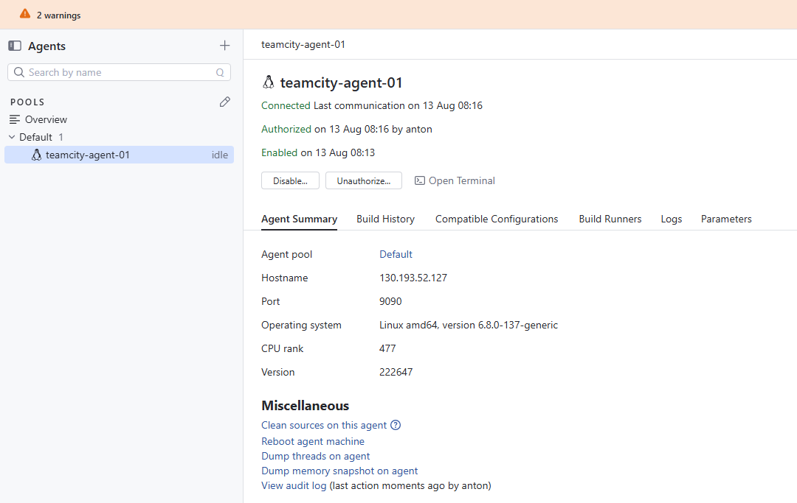
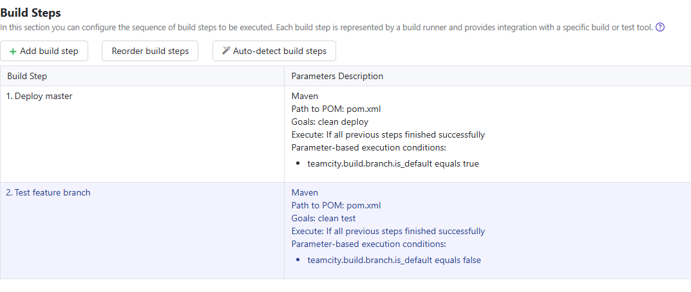
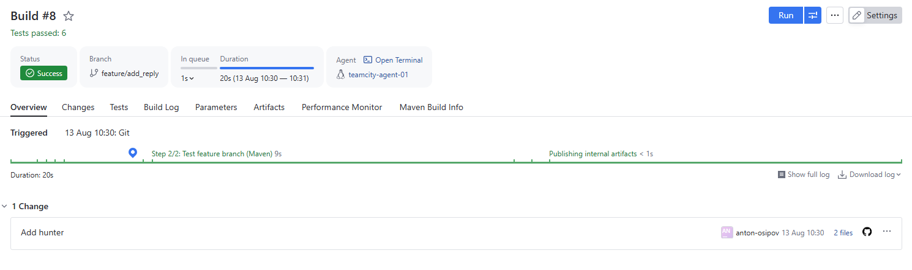
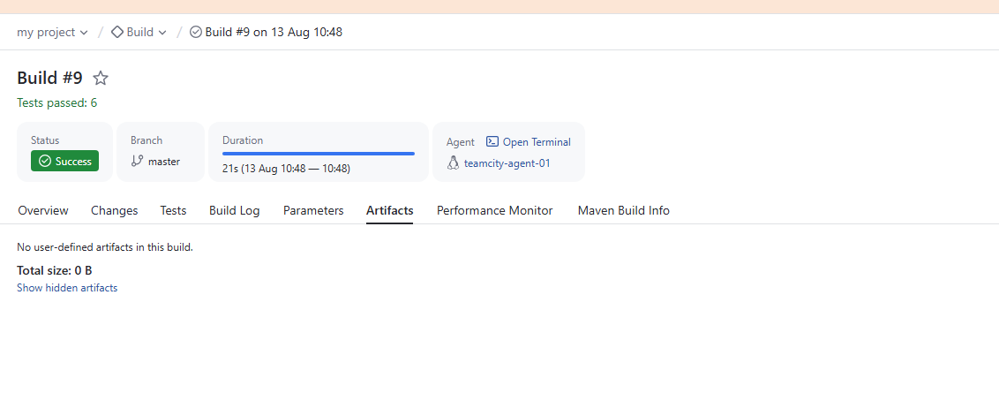
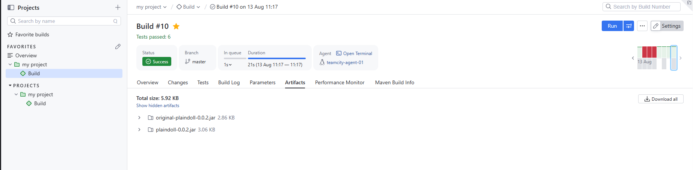

# Домашнее задание «TeamCity»

## Подготовка

Созданы три виртуальные машины:

- Nexus
- TeamCity Server
- TeamCity Agent

Выполнена первоначальная установка (docker container) и настройка сервисов.

Авторизован агент teamcity:



## Настройка TeamCity

Создан проект на основе fork репозитория:

https://github.com/osipovanton/example-teamcity

Настроены два шага:



## Nexus

Настроил nexus. Добавил ссылку на репозиторий maven-releases в `pom.xml`.
После запуска сборки ветки master артефакт успешно загрузился в Nexus.

## Ветка feature/add_reply

Создал новую ветку:

```text
feature/add_reply
```

В класс `Welcomer` добавил метод:

```java
public String sayHunterReply() {
    return "Head hunter";
}
```

Также добавил тест, который проверяет наличие слова `hunter`:

```java
@Test
public void welcomerNewReplyContainsHunter() {
    assertThat(welcomer.sayHunterReply(), containsString("hunter"));
}
```

После push ветки TeamCity автоматически запустил сборку.

Для feature-ветки выполнился:

```text
mvn clean test
```



# Merge в master
Выполнил мердж двух веток.

TeamCity автоматически запустил новую сборку `master`.

До настройки Artifact paths во вкладке Artifacts не было артефактов:



После этого в настройках Build Configuration добавил:

```text
target/*.jar
```

Повторно запустил сборку `master`.

В результате появились артефакты .jar



Настройка Artifact paths также сохранилась в `.teamcity/settings.kts`:
